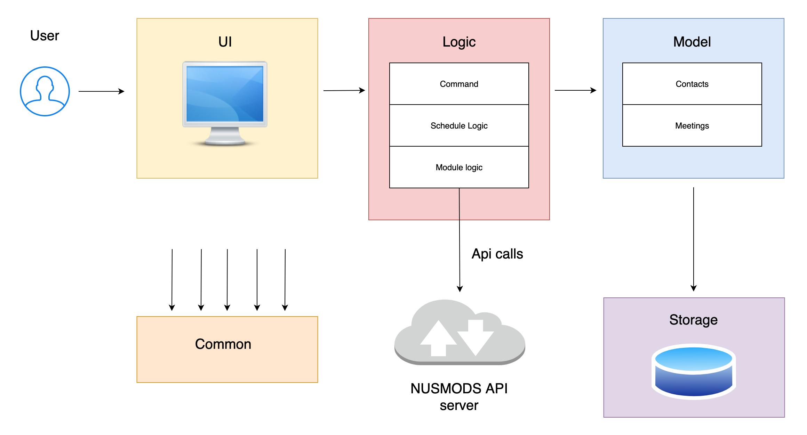
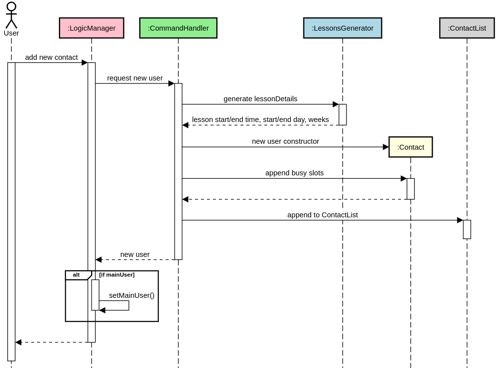
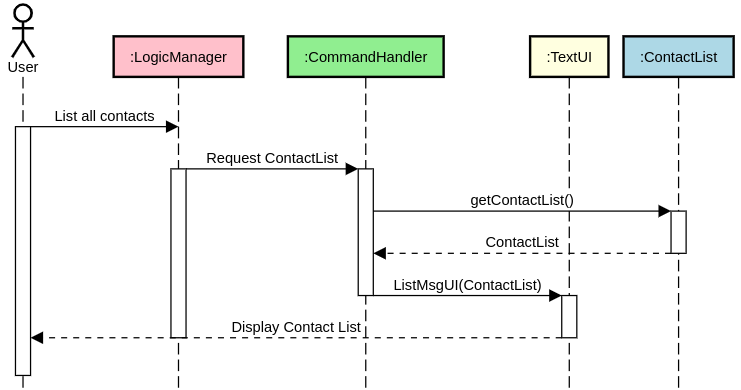
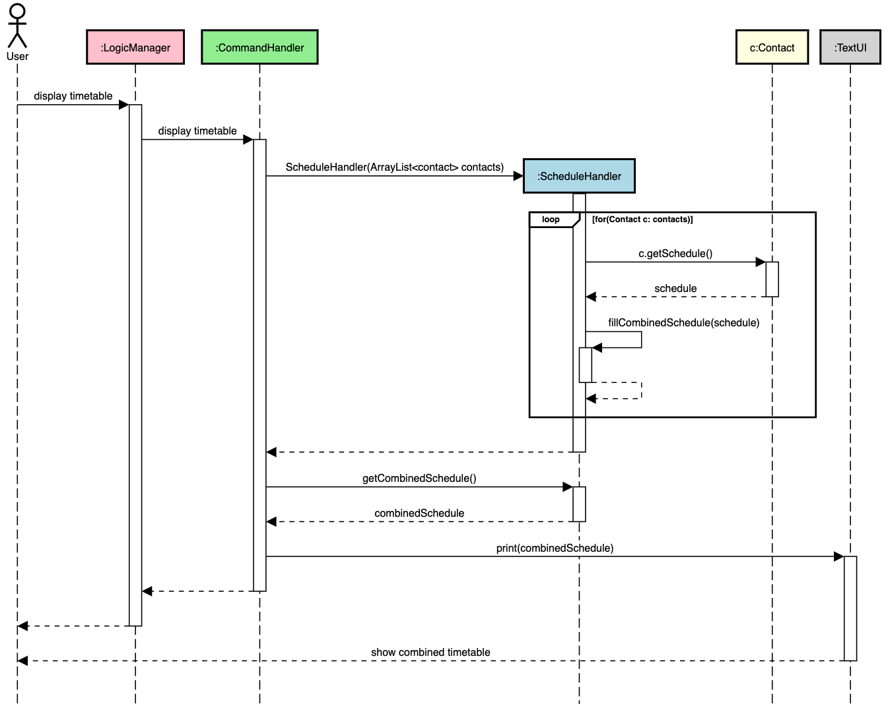
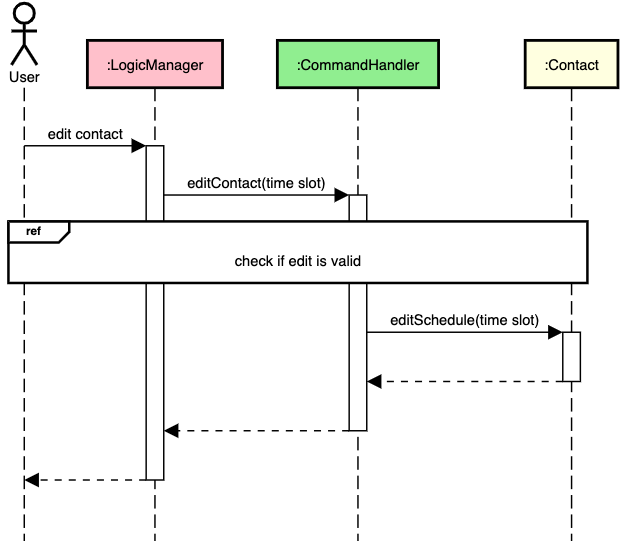
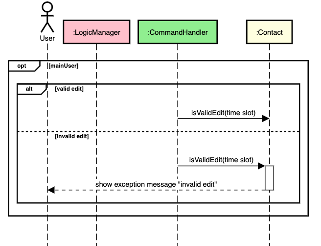

# WhenFree - Developer Guide
By: `AY1920S2-CS2113T-T12-1`

## Table of Contents
* [1. Setting up](#1-setting-up)
    * [1.1. Prerequites](#11-Prerequisites)
    * [1.1. Setting up project](#12-Setting-up-project)
    * [1.1. Verifying setup](#13-Verifying-setup)
* [2. Design](#2-design)
	* [2.1. Architecture](#21-architecture)
	* [2.2. UI component](#22-ui-component)
	* [2.3. Logic component](#23-logic-component)
	* [2.4. Model component](#24-model-component)
	* [2.5. Storage component](#25-storage-component)
	* [2.6. Common component](#26-common-classes)
* [3. Implementation](#3-implementation)
	* [3.1. Add new contact](#31-add-new-contact)
	* [3.2. List all contacts](#32-list-all-contacts)
	* [3.3. Display timetable of selected contacts](#33-display-timetable-of-selected-contacts)
	* [3.4. Schedule a new meeting](#34-schedule-a-new-meeting)
	* [3.5. Edit a contact's timetable](#35-edit-a-contacts-timetable)
	* [3.6. Delete a scheduled meeting](#36-delete-a-scheduled-meeting)
	* [3.7. Delete a member](#37-delete-a-member)
	* [3.8. List all scheduled meetings](#38-list-all-scheduled-meetings)
* [4. Documentation](#4-documentation)
* [5. Testing](#5-testing)
* [6. Dev Ops](#6-dev-ops)
* [Appendix A: Product Scope](#appendix-a-product-scope)
	* [A.1. Target user profile](#a1-target-user-profile)
	* [A.2. Value proposition](#a2-value-proposition)
* [Appendix B: User Stories](#appendix-b-user-stories)
* [Appendix C: Use Cases](#appendix-c-use-cases)
* [Appendix D: Non-Functional Requirements](#appendix-d-non-functional-requirements)
* [Appendix E: Glossary](#appendix-e-glossary)
* [Appendix F: Product Survey](#appendix-f-product-survey)
* [Appendix G: Instructions for Manual Testing](#appendix-g-instructions-for-manual-testing)
	* [G.1. Launch and Shutdown](#g1-launch-and-shutdown)
	* [G.2. Saving data](#g2-saving-data)

## 1. Setting up
Prerequisites<br>
1. Ensure Java Development Kit(JDK) is 11 or above.
2. IDE of your choice. :+1: We recommend IntelliJ IDE since this project is built upon the features of IntelliJ
3. The setting up of this project would assume that Intellij IDE is your preferred choice of IDE.

Setting up the project<br>
1. Fork this repository and ```git clone``` it onto your computer.
2. Open Intellij and import the ```build.gradle``` from project directory of the cloned repository.
[NOTE] If this your first time opening Intellij, you will be greeted wi4. Open ```Gradle``` from the vertical right tabs and type ```gradle run``` to build the project.th a welcome screen. Click ```import project``` > ```build.gradle``` to open up the project.
3. Set up the correct JDK version for Gradle:
    * Click the ```File``` tab > ```Project Structure``` > ```Platform Settings``` > ```SDK```.
    * Select the path where your JDK(>11) is installed. Click this link if you do not have at least JDK11.

Verifying Setup
1. Open ```Gradle``` from the vertical right tabs and type ```gradle run``` to build the project.
2. Try out a few commands as shown on the CLI menu. Click here to know more about each commands.


## 2. Design

### 2.1. Architecture
<br>

The architecture diagram above shows an overview of the high-level design of MeetingOrganizer. Meeting Organizer
adopts an n-tier style architecture where higher layers make use of the services provided by the lower layers.
Here is a quick overview of each layer and the components residing in it.
* UI: The CLI user interface of the application.
* Commons: A collection of classes containing constants such as messages for ```common.exception```, modules that can't be formatted, etc.
* Logic: The main control unit of the application which handles the business logic of the application.
* Model: Holds the data of the application in memory which is easily accessible by any methods that requires it.
* Storage: Writes data from Model layer to hard disk, as well as reading previously saved data from hard disk and storing it into Model layer.

### 2.2. UI component
[Structure of UI layer]

The UI consists of....
### 2.3. Logic component
<br>

The LogicManager is the brain and backbone of the logic component. It depends on 3 sub-components for it to work.
First, ```command``` sub-component would be initialize to interpret the user commands. 
Afterwards, LogicManager instantiates```schedulelogic``` and ```modulelogic``` sub-components via ```CommandHandler``` to enable the generation of common time slots from NUSMODS links.
LogicManager forms a whole-part relationship with the classes in the Model component, mainly ```ContactList``` and ```MeetingList``` where all the data generated from user commands would be stored. Besides, ```LogicManager``` also stores a ```mainUser:Contact``` containing the user's timetable
which is used to store scheduled meetings.

### 2.3.1. Logic.modulelogic component

The modulelogic component retrives modules and module information from NUSMODS links.
The modulelogic component consists of 4 classes: ```TimetableParser```, ```ModuleApiParser```, ```ModuleHandler```, ```LessonsGenerator```.

1. ```LessonsGenerator``` uses the ```TimetableParser``` class to acquire the modules a user is taking, including the timeslots of those modules.
2. ```LessonsGenerator``` also uses ```Modulehandler``` to retrieve a set of information related to a specific module.
3. With both information, ```LessonsGenerator``` is able to dynamically generate the user's time-slots stored in ```ArrayList<String[]>``` via a series of Key-Value pair hashing.
4. ```Arraylist<String[]> ``` contains the start/end time, days and weeks of all modules the user is taking.
<br>

**Design of Logic.modulelogic component**
 
<br>

The above figure shows the interaction between the 4 classes in ```Logic.modulelogic``` sub-component whenever a new user keys in his/her NUSMODS link.
1. ```ModuleApiParser``` controls the API fetching logic and instantiates a HTTP GET request object to fetch a Json object from the open-sourced NUSMOD API server via ```parse()```
2. ```ModuleApiParser ``` is called by ```ModuleHandler``` every time a new module is requested.
4. Subsequently, ```ModuleHandler``` would clean the data and filter out any blacklisted modules provided by ```ModuleApiParser```, and stores the information into an ```ArrayList<ArrayList<String>>``` data structure to be used by ```LessonsGenerator```.
   Blacklisted modules are filtered out based on the data from ```common.BlacklistedModule```. 
3. Next, ```TimetableParser``` fetches the module information a user is currently taking from his/her timetable link via ```parse()```. ```parse()``` and ```parseModule()```  makes use of regex to sift through timetable link provided by user in the form of ```String``` object and stores
the information in a ```Map<String, ArrayList<String>>``` data structure as seen from the figure. 
4. This sub-component also depends on the ```common.Messages``` class to provide the exception message when an incorrect link is being parsed.<br>

<br>

The above figure shows a full overview of the UML sequence of the entire Logic.modulelogic component.<br>

```LessonsGenerator``` collates the returned data structure from both ```ModuleHandler``` and ```TimetableParser```, calling```.lessonsChecker()``` simultaneously to create a set of information containing the start-time, end-time, day, weeks of the modules that a user is taking.
 
The information returned from ```LessonsGenerator``` would then be used in ```Command``` component.
 
### 2.3.2. Logic.schedulelogic component

The ```schedulelogic``` component finds common time slots from team members' schedules.
The ```schedulelogic``` consists of the class ```ScheduleHandler```. 

1. ```ScheduleHandler``` retrieves the schedule of ```Contact```s to generate a combined schedule.

**Design of Logic.schedulelogic component**
 
<br>

### 2.3.4. Logic.commands component
The ```commands``` component interprets the user command and call the ```modulelogic``` and ```schedulelogic``` components.
The ```commands``` consists of the class ```CommandHandler```.

### 2.4. Model component
The ```model``` component holds data generated in the application in memory. The data can be accessed by methods that require
it when the application is running. The model component contains 2 sub-components: ```meeting```, ```contact```

### 2.4.1. Model.meetings component
The ```meetings``` component of our application consists of 2 classes: ```Meeting```, ```MeetingList```
<br>

### 2.4.2. Model.contacts component
The ```contacts``` component of our application consists of 2 classes: ```TeamMember```, ```TeamMemberList```
1. ```TeamMember``` consists of information of a member's name and schedule.
2. ```TeamMemberList``` is a ```Arraylist<TeamMember> ``` which new ```TeamMember``` can be added to.

### 2.5. Storage component


Above image shows the structure of Storage object. It is created by MeetingOrganizer class to handle the loading and saving of scheduled meetings and member schedules.

The `Storage` component,
- can save `Contact` objects in .txt format and read it back.
- can save scheduled meetings in .txt format and read it back.

### 2.6. Common component
#### 2.6.1 Exception classes
### 2.6. Exception classes

### 2.7. Common classes
Classes used by multiple components are in the ```commons``` package. These includes exception classes, information of 
blacklisted modules as well as output messages to be shown to users when exception occurs.


## 3. Implementation
This section describes some noteworthy details of how the main features of our application works in the backend.

There are 6 main features: add new contact, list all contacts, display combined timetable of selected contacts, schedule a new meeting, delete a scheduled meeting, list all scheduled meetings.
### 3.1 Add new contact
<br>
The figure above shows the sequence diagram of the ```addContact``` command.

Given below is an example usage scenario and how the ```add contact``` command behaves.

1. The user running the application invokes the ```LogicManager``` by typing ```name nusmodslink```, followed by kbd:[enter] key.
2. ```LogicManager```would then request for a new contact by calling ```CommandHandler```.
3. ```CommandHandler``` would call ```generate()``` on ```LessonsGenerator``` to retrieve the lesson's start/end time, start/end day, and the number of weeks the lesson is held.
4. ```CommandHandler``` would also instantiate a new ```Contact``` and append the busy slots that were previously generated by ```generate()```.
5. Subsequently, control would be shifted back to ```LogicManager``` where the new ```Contact``` would be returned by ```CommandHandler```.
6. ```LogicManager``` checks if the ```Contact``` is a main user and calls ```setMainUser()``` accordingly.
7. The final procedure is to append the new ```Contact``` into ```ContactList``` found in the ```model``` component.

### 3.1.1 Design Considerations
**Aspect 1: Optimizing fetching of module information**
* Alternative 1(current choice): Instantiate a ```ModuleHandler``` every time there's a request for a module information.
Pros: The classes are intuitively separated and data structures returned is understandable.
Cons: Program runs slower for every extra timetable or extra modules taken since its a new instantiation of a ```ModuleHandler```.
* Alternative 2: Instantiate ```ModuleHandler``` once for every user. 
Pros: Takes up less memory and setup time for every timetable provided compared to alternative 1.
Cons: The data structure returned by ```ModuleHandler``` would be complicated and confusing for new developers.

**Aspect 2: Ways of storing blacklisted module**
* Alternative 1(current choice): Create a ```common.BlacklistedModule``` and hash every hard-coded blacklisted module as a constant ```HashSet```.
Pros: There is no need for user to download the blacklisted module, and only the JAR file is required to run this entire application.
Also, user do not need to have a one time set-up where they would wait several minutes for the application to dynamically pull the blacklisted modules from Nusmods API server.
Cons: If the blacklisted modules from Nusmods API gets updated to the conventional 13 weeks programme, developers would have to manually delete the information of those modules from
the blacklist, resulting in time wasted everytime there's an update to module information.
* Alternative 2: Dynamically pull the data from Nusmods API server once when user starts the application to retrieve the blacklisted modules, and then periodically update the 
blacklisted modules every semester.
Pros: The blacklisted modules would be up to date and there is no need for developers to manually edit the ```common.BlacklistedModule``` class.
Cons: The one-time set up of pulling the data is very time consuming(~2 minutes waiting time), resulting is bad user experience.
* Alternative 3: Requires user to download the list of blacklisted modules in addition to the JAR file. 
Pros: User do not have to wait for the one-time set up and the file would be up to date as long as the application is not deprecated.
Cons: Developers would still have to run the method to dynamically pull the blacklisted modules, although it would be less prone to mistake caused by editing the hard-coded blacklist as mentioned in
Alternative 1. Furthermore, users are required to download the blacklisted file published by the developers every semester in order for the list to be up-to-date.

### 3.2 List all contacts
<br>

The figure above shows the sequence diagram of listing all contacts saved in the application. 
It consists of 4 classes:```LogicManager Commandhandler TextUI ContactList``` .

Given below is an example usage and how the```ListContact``` command behaves.

1. The user invokes the LogicManager by typing ```contacts```, followed by kbd:[enter] key.
2. The ```LogicManager``` would then request to list all contacts via ```CommandHandler```.
3. The ```CommandHandler``` would call ```getContactList()``` on ```ContactList``` from storage and then using the ContactList retrieved, it then calls ```ListMsgUI()``` from ```TextUI``` class.
4. The result is that ```TextUI``` would return a ```System.out.println``` of all the contacts the user have.


### 3.3 Display timetable of selected contacts
<br>

The figure above shows the sequence diagram of displaying a combined timetable of selected contacts. 
It consists of 5 classes:```LogicManager``` ```Commandhandler``` ```ScheduleHandler``` ```Contact``` ```TextUI``` .

Given below is an example usage and how the ```DisplayTimetable``` command behaves.

1. The user invokes the LogicManager by entering ```timetable <contact index A> <contact index B>```.

    NOTE: ```<contact index A>``` and ```<contact index B>``` represent the ```Contact```s whose combined timetable is 
    to be displayed.
2. The ```LogicManager``` requests to display the combined timetable via ```CommandHandler```.
3. The ```CommandHandler``` retrieves ```Contact```s from ```ContactList``` using the contacts' index passed into the 
command, to generate ```arrayList<Contact>```.

    NOTE: This step is omitted in the sequence diagram to keep it concise.
3. The ```CommandHandler``` calls the ScheduleHandler constructor ```ScheduleHandler(ArrayList<Contacts>)```.
4. For each ```Contact```, ```ScheduleHandler``` retrieves its schedule by calling ```getSchedule()```. ```ScheduleHandler``` 
then uses the retrieved schedule to fill a combined schedule, adding all "busy" time blocks of the retrieved schedule into the
combined schedule.
5. ```CommandHandler``` retrieves the final combined schedule and calls ```TextUI``` to print the combined schedule.
6. ```TextUI``` returns a ```System.out.println``` of the combined schedule in an ASCII timetable diagram. 

### 3.4 Schedule a new meeting

### 3.5 Edit a contact's timetable
<br>

The figure above shows the sequence diagram of editing the schedule (timetable) of a selected contact at a given time slot. 
It consists of 3 classes:```LogicManager``` ```Commandhandler``` ```Contact```.

Given below is an example usage and how the ```EditContact``` command behaves.

1. The user invokes the LogicManager by entering ```edit <contact index> <time slot>```.

    NOTE: The original user input formats for ```EditCommand``` are: 
    <br>```edit busy <contact index> <start day> <start time> <end day> <end time>``` and 
    <br>```edit free <contact index> <start day> <start time> <end day> <end time>```, 
    <br>for editing the ```Contact```'s schedule to "busy" and "free" at the given time slot respectively. 
    We generalise ```edit busy``` and ```edit free``` as ```edit``` in the sequence diagram as their execution is similar. 
    We also represent ```<start day> <start time> <end day> <end time>``` as ```<time slot>``` in the sequence diagram to
    keep it concise.
    
2. The ```LogicManager``` requests to edit a contact's schedule via ```CommandHandler```.
3. The ```CommandHandler``` retrieves ```Contact``` from ```ContactList``` using the contact's index passed into the 
command.

    NOTE: This step is omitted in the sequence diagram to keep it concise.
4. The ```CommandHandler``` calls ```editSchedule(time slot)``` of ```Contact```.
If ```edit busy```, the schedule of `Contact` will be marked as "busy" for the given time slot. If ```edit free```, the 
schedule of `Contact` will be marked as "free" for the given time slot.

The schedule of the `Contact` is edited and saved in the application.

### 3.5.1 Design Considerations
**Aspect 1: Clash of ```Meeting```'s time slot and ```EditContact```'s time slot when editing main user's schedule**

The implementation described above would allow the overwrite of any time blocks in the ```Contact```'s schedule. This  
would be problematic when editing the main user's schedule, which contains ```Meeting```s' time slots. A possible problematic 
scenario is if we edit over a ```Meeting```' time slot and set the time slot to "free", we would subsequently be able to schedule 
another meeting at the same time slot. This results in multiple ```Meeting```s occupying the same time slot.

* Alternative 1(current choice): Disallow the overwrite of ```Meeting```'s time slot. If ```EditContact```'s time slot 
clashes with any ```Meeting```'s time slot, throw error to discontinue edit of that time slot.
* Alternative 2: Allow the overwrite of ```Meeting```'s time slot. If ```EditContact```'s time slot clashes with any 
```Meeting```'s time slot, remove the ```Meeting``` from ```MeetingList```. 

We choose Alternative 1 for these reasons:
1. The intended purpose of the edit function is to make amendments to schedules pulled
 from NUSMODS so that additional "busy" slots or "free" slots can be visualized in the timetable, not to edit over meetings. 
2. Editing of a ```Meeting```'s time slot to be "free" will be equivalent to deleting the ```Meeting```, for 
which there is a dedicated feature implemented. This causes unnecessary overhead in functionality.
3. Alternative 1 is easier to implement. When a clash is detected, Alternative 1 requires only the throwing of exception, 
whereas Alternative 2 would require the removal of ```Meeting``` from ```MeetingList```.<br><br>

<br>

The figure above shows the sequence diagram illustrating the implementation of Alternative 1. Checking validity of 
edit is done before editSchedule() of `Contact` is called. (Fig. 1)
1. This path is optional, and is only implemented if `Contact` the main user.
2. `CommandHandler` calls isValidEdit(time slot) of the `Contact` class.

3. isValidEdit(time slot) uses the `Contact`'s schedule to check any of the time blocks within the time slot is a
    "meeting" time block. 
4. If no  "meeting" time block is detected within the time slot, the edit is valid. The program continues running and 
    editSchedule() will be called.
5. If a  "meeting" time block is detected within the time slot, the edit is invalid. An invalid exception is thrown by 
    `Contact`, and the user will be informed that the edit is invalid.
    
    NOTE: `TextUI` and `Exception` classes which are used in generating the exception, and displaying the exception message
    to the user are omitted to keep the sequence diagram concise.
    
### 3.6 Delete a scheduled meeting

### 3.7 Delete a member

### 3.8 List all scheduled meetings

## 4. Documentation

## 5. Testing

## 6. Dev Ops

## Appendix A: Product Scope
### A.1. Target user profile
Our application, MeetingOrganizer, is for NUS students and teaching assistants looking to save time finding
free-slots for their project meetings, consultations etc. It allow users to add their team members and tutees respectively, and
finding a time-slot where everyone would be free.
Target user profile:
* Our application if for users that are comfortable using CLI apps and prefer desktop applications rather than phone apps.
* Our application targets users in NUS that wish to easily find free-slots amongst their peers studying in NUS as well.
* Our application tracks the meetings the user have and shows them on a timetable generated dynamically in CLI.


### A.2. Value proposition
* By using this application, NUS students/staff are able to save time planning schedule for their group meetings by simply providing
the application with their respective NUSMODS website link instead of manually keying in their timetable individually.
* Our application allows NUS students/staff to save their scheduled meeting into their timetable. Our application would take the user's
meetings into account when scheduling a common timeslot timetable.
* Our application provides NUS students/staff with a friendly CLI-based timetable interface when scheduling common-timeslots.

## Appendix B: User Stories

|Version| As a ... | I want to ... | So that I can ...|
|--------|----------|---------------|------------------|
|v1.0| As a student | I want to delete the meetings in the calendar| so that I can afford to make mistakes while planning for the meeting. |
|v1.0| student with many friends | I want to schedule lunch dates with my friends | so that i can maintain my social circle.  |
|v1.0| As a TA | I want to organize my timetable and consult sessions | so that it can all be in one place.  |
|v1.0| As a student who uses various calendars | I want to schedule everything in one place | so that i can access all my events from one medium.  |
|v1.0| As a forgetful student | I tend to forget which project meetings I have planned for the week and hence| so the application allows me to save the schedule and look through it for reference.  |
|v1.0| As a busy student | I want to have more family outings without sacrificing my lecture/tutorial timings |  so that I can score good grades and have a life both at the same time. |
|v2.0| As an impatient student | I want to directly copy/paste timetable links | so that i can instantly generate suitable time slots for our project meetings. |
|v2.0| As a student | I want to use this to be organized in terms of what meetings i have for the coming week | so that I would be a responsible team member who shows up at every meeting. |
|v2.0| As a busy student | I want to use this application to manage my schedule  | so that i can plan my time wisely. |
|v2.0| As a TA | I want to use this to schedule consults and marking sessions without sacrificing my tutorial/lecture slots | so that I can get the best TA award and maintain my grades at the same time. |
|v2.0| As a lazy student | I want to use this application to automatically sync my previous meeting onto a new schedule profile | so that I can automatically block out dates instead of typing it manually. |
|v2.0| As a student | I want to see the list of upcoming meeting dates  | so that i can remind myself which meetings i have to go for in the coming week. |
|v2.0| a | a | a |
## Appendix C: Use Cases

## Appendix D: Non-Functional Requirements

1. Should work on any mainstream OS as long as it has Java 11 SDK or above installed.
2. Should be able to hold up to hundreds of meetings and timetables without a noticeable increase in application's performance and latency.
3. A fast typist user preferring CLI applications, with above average typing speed(>65wpm) for regular English text should be able to accomplish most tasks faster than a GUI application using mouse.
4. Should come with automated unit tests in case you encounter any bugs while developing new feature, and it should be open sourced for the anyone.
5. Should work on both 32-bit and 64-bit environments.
6. Should not exceed 100MB in size given normal usage.

## Appendix E: Glossary

* *Blacklisted modules* - Blacklisted modules are modules that doesn't follow the conventional 13 weeks programme and as such, the JSON pulled from NUSMODS api is unable to be processed by ```Logic.modulelogic``` component.
<br>

## Appendix F: Product Survey

## Appendix G: Instructions for Manual Testing

Given below are instructions to test the app manually.

> :information_source: These instructions only provide a starting point for testers to work on; testers are expected to do more _exploratory_ testing. 

### G.1. Launch and Shutdown

### G.2. Saving data
