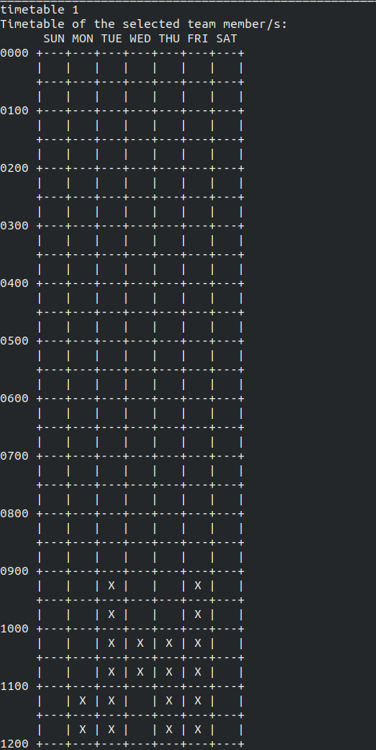
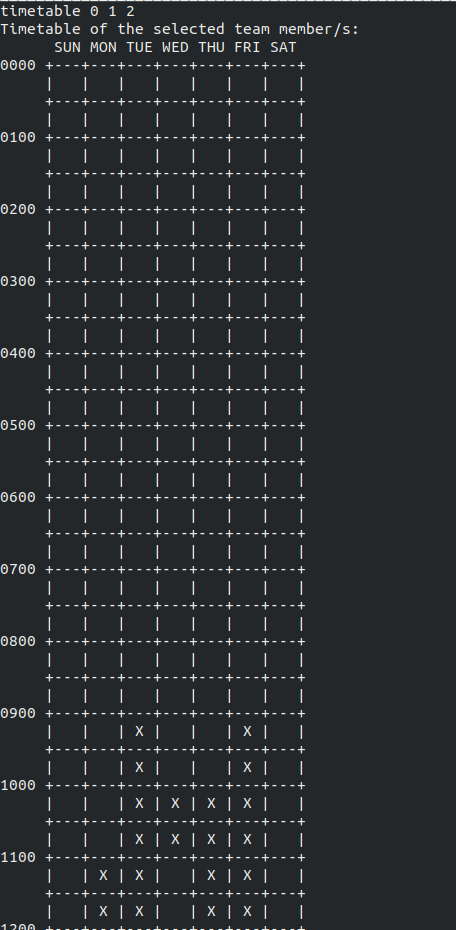

# WhenFree - User Guide
 * [1. Introduction](#introduction)  
 * [2. Quick Start](#quick-start)  
 * [3. Features](#features)
 * [4. FAQ](#faq)
 * [5. Command Summary](#command-summary)
 
<br/><br/>

## Introduction

WhenFree is a scheduler chatbot that helps you find common free time among your and your friends, 
using just the NUSMODS links to your school timetable.

WhenFree is for NUS students who want to save time gathering their friends' schedules to set up a 
meeting, whether for a long project discussion or a quick meal. With an easy-to-use command line interface, anyone can
set up and use this application easily by following along this User Guide.

Get ready the NUSMODS links of you and your friends, and let's get started!

<br/><br/>

## Quick Start

1. Ensure that you have Java 11 or later versions of Java installed on your computer. 
    - To check the version of Java on your computer, follow the instructions [here](https://www.wikihow.com/Check-Your-Java-Version-in-the-Windows-Command-Line). 
    - To download the latest version of Java on your computer, visit [here](https://www.oracle.com/java/technologies/javase-downloads.html).
2. Download the .jar file of our latest release of WhenFree, V2.1 [here](https://github.com/AY1920S2-CS2113T-T12-1/tp/releases).
3. Copy the downloaded .jar file to an empty folder.
4. Open Command Prompt or Terminal and navigate to the folder using ```cd <folder_path>```.
5. Run the .jar file using ```java -jar <file_name.jar>```.

You will see this welcome message if you have done the above steps correctly.

TODO: change image


The following part of the User Guide will explain the features of WhenFree in detail. You can follow along as we go through each of the features if you are starting out, or skip ahead to the [Command Summary](#command-summary) to see the commands of all features.

<br/><br/>

## Features 

- [Add a new contact](#add-a-new-contact)
- [List all contacts](#list-all-contacts-contacts)
- [Display timetable of selected contacts](#display-timetable-of-selected-contacts-timetable)
- [Schedule a new meeting](#schedule-a-new-meeting-schedule)
- [Edit a contact's timetable](#edit-a-contacts-timetable-edit)
- [Delete a meeting](#delete-a-meeting-delete--m)
- [Delete a contact](#delete-a-contact-delete--c)
- [List all meetings](#list-all-meetings-meetings)
- [Exit application](#exit-the-application-exit)

<br/>

### Add a new contact
Adds you or your friend into the list of contacts. 
You will need to key in **name** and **NUSMODS link** of the 
contact.

Format: 
    
    <name> <NUSMODS link>

Example of usage:

    Juan https://nusmods.com/timetable/sem-2/share?CG2023=LAB:03,PLEC:01,PTUT:01&CG2027=TUT:01,LEC:01&CG2028=TUT:01,LAB:02,LEC:01&CS2101=&CS2107=TUT:08,LEC:1&CS2113T=LEC:C01

Example output:

TODO: change image so that the words are the same font size


Note:
- You must add in your (main user's) contact before you can use the application. 
If you try to enter a command before adding in your contact, WhenFree will remind
you to key in your contact first.
TODO: change image

- You can add as many contacts as you want thereafter.

[&#8593; Return to list of Features](#features)

<br/>

### List all contacts: `contacts`
Displays index and names of all added contacts stored in the program.

Format:
    
    contacts 

Example of usage: 
    
    contacts

Example output:


[&#8593; Return to list of Features](#features)

<br/>

### Display timetable of selected contacts: `timetable`
**Use case 1:** Displays your (main user's) timetable.
    
Format: 
    
    timetable 
        
Example of usage: 
    
    timetable

Example output:

TODO: update image

    
A cross in a 30-minute square of the timetable represents "busy", while an empty square represents "free".

<br/>

**Use case 2:** Displays the timetable of a selected contact. You will need to key in **Contact Index** of the selected contact.

Format: 
    
    timetable <Contact Index>
    
Example of usage: 
    
    timetable 1
    
Example output:

TODO: update image


<br/>

**Use case 3:** Displays the combined timetable of multiple selected contacts. You will need to key in **Contact Index** of 
each of the selected contacts.
   
Format: 
   
    timetable <Contact A Index> <Contact B index> ...
   
Example of usage: 
   
    timetable 0 1 2
    
Example output:

TODO: update image

    
Note:
- **To see up to two weeks of timetable, type in `more` as your next command.** You can only display up to 2 weeks of timetable.
- You can check `<Contact Index>` of the contact(s) whose timetable you wish to display, by listing all contacts using 
[`contacts`](#list-all-contacts-contacts).
- Both `timetable` and `timetable 0 ` display your (main user's) timetable.

[&#8593; Return to list of Features](#features)

<br/>

### Schedule a new meeting: `schedule`
Schedules a new meeting at a specified time slot and adds it into the meeting list. You will need to key in 
**Meeting Name**, and specify the meeting time slot with **Start Day**, **Start Time**, **End Day**, **End Time**.

Format: 

    schedule <Meeting Name> <Start Day> <Start Time> <End Day> <End Time>

Example of usage:

    schedule meeting 3 17:00 3 19:00

Example output:


<br/>

Note:
- Scheduling a meeting will modify only your (main user's) timetable, to be busy at the specified time slot. 
Timetables of other contacts will not be modified.
- You cannot schedule a meeting if your timetable is busy at the specified time slot. When Free will remind you to check
your timetable if you try to schedule a meeting during a time slot which you are busy for.

[&#8593; Return to list of Features](#features)

<br/>

### Edit a contact's timetable: `edit`
**Use case 1:** Edits a contact's timetable to be **busy** for a specified time slot. You need to key in **Contact Index**
of the contact, and specify the time slot to be marked busy with **Start Day**, **Start Time**, **End Day**, **End Time**.

Format: 
    
    edit busy <Contact Index> <Start Day> <Start Time> <End Day> <End Time>
    
Example of usage:
    
    edit busy 0 2 22:00 2 23:00
        
Example output:

TODO change image


<br/>

**Use case 2:** Edits a contact's timetable to be **free** for a specified time slot. You need to key in the **Contact Index** of
 the contact, and specify the time slot to be marked free with **Start Day**, **Start Time**, **End Day**, **End Time**.
    
Format: 
    
    edit free <Contact Index> <Start Day> <Start Time> <End Day> <End Time>
    
Example of usage:
 
    edit free 0 2 22:00 2 23:00
        
Example output:

TODO change image

    
Note: 
- You can check `<Contact Index>` of the contact whose timetable you wish to edit, by listing all contacts using 
[`contacts`](#list-all-contacts-contacts).
- You can check the timetable of the contact you wish to edit, by displaying his/her timetable using 
[`timetable <Contact Index>`](#display-timetable-of-selected-contacts-timetable).

[&#8593; Return to list of Features](#features)
    
<br/>

### Delete a meeting: `delete -m`
Deletes a scheduled meeting from the meeting list. You will need to key in **Meeting Index** of the meeting you wish 
to delete.

Format:
    
    delete -m <Meeting Index>

Example of usage:

    delete -m 1

Example output:

TODO change image


Note:
- You can check `<Meeting Index>` of the meeting you wish to delete, by first listing all meetings using [`meetings`](#list-all-meetings-meetings).
- Be careful to include the -m tag in `delete -m` when you wish to delete a meeting. 
- `delete -m` which is used to delete a meeting, should be differentiated from `delete -c` which is used to delete a contact.

[&#8593; Return to list of Features](#features)

<br/>

### Delete a contact: `delete -c`
Deletes a contact from the contact list. You will need to key in **Contact Index** of the contact you wish 
to delete.

Format: 
    
    delete -c <Contact Index>

Example of usage:

    delete -c 1
    
Example output:

TODO change image


Note:
- You can check `<Contact Index>` of the contact you wish to delete, by first listing all added contacts using [`contacts`](#list-all-contacts-contacts).
- Be careful to include the -c tag in `delete -c` when you wish to delete a contact. 
- `delete -c` which is used to delete a contact, should be differentiated from `delete -m` which is used to delete a meeting.

[&#8593; Return to list of Features](#features)

<br/>

### List all meetings: `meetings`
List all scheduled meetings stored in program.

Format: 
    
    meetings

Example of usage: 

    meetings
    
Example output:


[&#8593; Return to list of Features](#features)

<br/>

### Exit the application: `exit`
Exits the application and ends the current session.

Format: 
    
    exit

Example of usage: 
    
    exit
    
Example output:


[&#8593; Return to list of Features](#features)

<br/><br/>

## FAQ
**Q**: How do I transfer my data to another computer? 

&ensp;&ensp;&ensp;&ensp;**A**: Copy the `data` file in the root directory and paste into the root directory in the other computer.
   
[&#8593; Return to the top](#whenfree-meeting-organizer---user-guide)

<br/><br/>

## Command Summary
Feature | Format | Example usage
------- | ------ | -------------
Adding a new contact | `<name> <NUSMODS link>` | `Juan https://nusmods.com/timetable/sem-2/share?CG2023=LAB:03,PLEC:01,PTUT:01&CG2027=TUT:01,LEC:01&CG2028=TUT:01,LAB:02,LEC:01&CS2101=&CS2107=TUT:08,LEC:1&CS2113T=LEC:C01`
List all contacts | `contacts` | `contacts`
Display timetable of selected contacts | `timetable` <br/><br/> `timetable <Member Index>` <br/><br/> `timetable <Member A Index> <Member B Index>` | `timetable` <br/><br/> `timetable 1` <br/><br/> `timetable 0 1 2`
Schedule a new meeting | `schedule <Meeting Name> <Start Day> <Start Time> <End Day> <End Time>` | `schedule meeting 3 17:00 3 19:00`
Edit a contact's timetable | `edit busy <Contact Index> <Start Day> <Start Time> <End Day> <End Time>` <br/><br/> `edit free <Contact Index> <Start Day> <Start Time> <End Day> <End Time>` | `edit busy 0 2 22:00 2 23:00` <br/><br/> `edit busy 0 2 22:00 2 23:00`
Delete a meeting | `delete -m <Meeting Index>` | `delete -m 1`
Delete a contact | `delete -c <Contact Index>` | `delete -c 1`
List all scheduled meetings | `meetings` | `meetings`
Exit application | `exit` | `exit`

[&#8593; Return to the top](#whenfree-meeting-organizer---user-guide)
